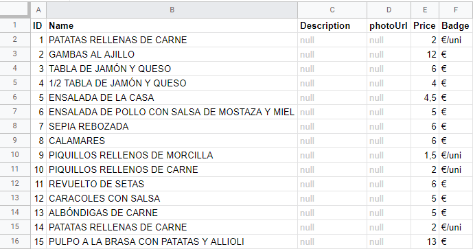
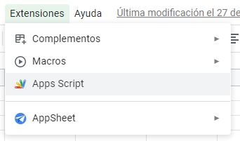
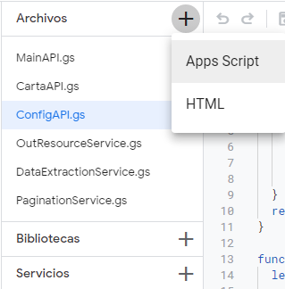

# Spreadsheet to JSON API
Con este set de scripts podemos convertir cualquier hoja de cálculo de Google en una API REST.

## 📝 Ejemplo
En este ejemplo ilustra una pequeña API que sirva la carta de un restaurante.
<table>
    <tr>
        <td>
            1.- Crear una hoja de google con el formato indicado en la imagen. Donde la primera fila se corresponde el nombre de la columna y cada fila corresponde a una entrada de datos.
        </td>
    </tr>   
    <tr>
        <td style="text-align:center;">
            
        </td>
    </tr>
    <tr>
        <td>
            2.- Crear el script de Google App Scripts desde el menú de 'Extensiones'.
        </td>
    </tr>
    <tr>
        <td style="text-align:center;">
            
        </td>
    </tr>
    <tr>
        <td>
            3.- Crear los diferentes ficheros necesarios.    Hay que tener en cuenta que esto se hace para tener el código más organizado cuando este es extenso, ya que una vez compilado Google lo fusiona en un mismo archivo.   Esto implica que no debemos repetir nombres de funciones y variables entre los diferentes ficheros para evitar posibles errores.
        </td>
    </tr>
    <tr>
        <td style="text-align:center;">
            
        </td>
    </tr>
    <tr>
        <td>
            4.- El fichero 'MainAPI.gs' representa el punto de entrada de la API. Aquí el método 'doGet()' nos permite capturar las peticiones GET lanzadas contra la API. También se define el ID de la hoja de cálculo que queremos consultar.
        </td>
    </tr>
    <tr>
        <td>
            5.- El fichero 'CartaAPI.gs' se encarga de leer aquellas hojas cuyo nombre empiezan por 'carta_'. Esto se filtra en el fichero 'MainAPI.gs'. De esta forma podemos tener diferentes tipos de respuesta para las diferentes hojas que podamos tener. Ejemplo: 'carta_', 'menu_, 'config_', etc
        </td>
    </tr>
    <tr>
        <td style="text-align:center;">
            
        </td>
    </tr>
    <tr>
        <td>
            6.- El fichero 'DataExtractionService.gs' nos permite obtener y formatear a JSON las columnas de la hoja de cálculo que especifiquemos.
        </td>
    </tr>
    <tr>
        <td>
            7.- El fichero 'PaginationService.gs' implementa los métodos necesarios para crear la información de paginación básica.
        </td>
    </tr>
    <tr>
        <td>
            8.- El fichero 'OutResourceService.gs' implementa los métodos para crear la respuesta JSON de la API REST.
        </td>
    </tr>
</table>